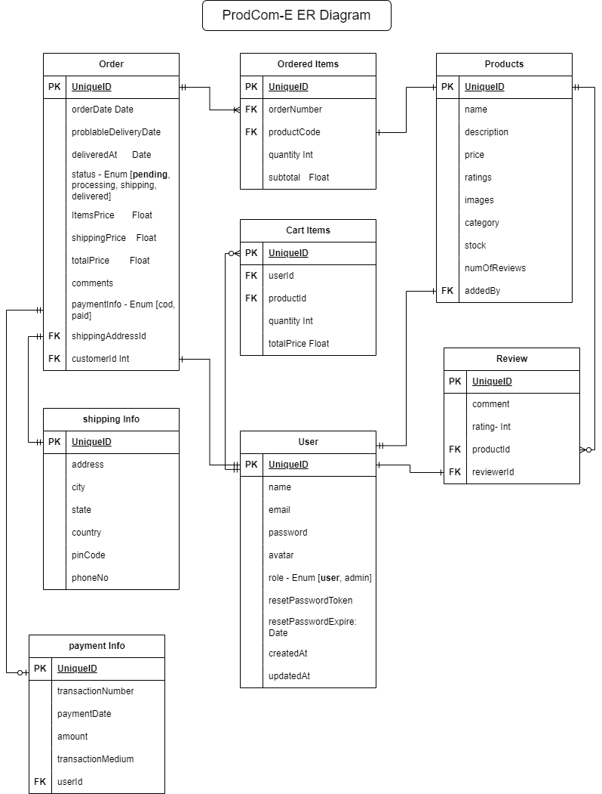

# E-commerce project

Project Name: **_ProdCom-E_**

GitHub repo: https://github.com/sifytul/ProdCom-E
Notion: https://smoggy-larch-f18.notion.site/E-commerce-project-1d4d31ef332f433c83e317ec21a03c3f?pvs=4

## Requirements:

- User
  - Users can sign up, log in, and log out.
  - Client, admin
- Products

  - Any guest or user can view the product list and specific product
  - Only Admin can add, update, and delete products

- Carts

  - Any user (guest/authenticated) can add any product to the cart
  - Users can view the item list added to the cart.
  - Cart items will be stored in a local storage

- Order
  - Only authenticated users can create an order.

### Time Frame: 30 days

### Start Project: 7/9/23

### Probable End: 7/10/23

## Tech Stack - PNNNT (Postgres, NestJS, NextJS, Node, TypeScipt)

- Backend
  Language: **TypeScript**
  - For type-safe development, TypeScript is suitable for developing bug-free code for production environments.
    Framework: **NestJS**
  - NestJS works in a modular way and it is mainly focused on type-safe development. It could be beneficial in maintaining our code in a future perspective.
    Database: **Postgres**
  - In an e-commerce website, we need to handle a lot of transactions. The data should be structured and schema based. So, we can use table to make data consistent. We need a DB that is industry standard, data consistent, durable, and fault tolerant. We assume that postgres can handle our expectation in this scenario.
    DB ORM: TypeORM or, Prisma
  - based on the robustness and stability, I chose TypeORM v0.3.17
- Frontend
  Framework: **NextJS**
  - As it is an e-commerce app, we need on-page SEO to rank. We need to render the page on the server to achieve this behavior. **NextJS** is currently a popular framework to handle the SSR and SSG. So we chose this.
    State management: **Redux Toolkit**
  - As we have to handle a bunch of states for users, products, carts, orders, payments, and so on, we need to use a robust state management tool. Redux toolkit is an industry-standard tool and it reduces much of the boilerplate code and handles immutable updates automatically over core redux. That’s why we believe, it can remove our headache to manage the state.
    Data fetching tool: **Rtk Query**
  - To improve the user experience, we need to use the caching technique. RTK Query handles this smoothly. So, we picked it for data fetching and caching purposes.

[Project Timeline for E-Commerce Fullstack Project](https://smoggy-larch-f18.notion.site/Project-Timeline-for-E-Commerce-Fullstack-Project-5af509f91da940ad81218b7463f43a12)

# Backend

## Routes

### Auth

- [x] POST - [public] - /auth/register
- Register a user

  Method: POST

  Access: Public

  Path: /auth/register

  Description: This route will create a user with provided payload

  Request body:

  - Name string
  - Email string
  - Password (hashed)

  Response :

  201:

  - success: true
  - accessToken: string
  - 400:
    - message: Bad request
    ```json
    {
      "success": false,
      "errors": [
        {
          "field": "email",
          "message": "duplicate email"
        }
      ]
    }
    ```

- [x] POST - [public] - /auth/login
- Login
  Method: POST
  Access: Public
  Path: /auth/login
  Description: This route will log in a user to the website
  Request body:
  - Email string
  - Password (hashed)
    Response :
  - 200 :
    response will set a refresh token in the cookies and provide response as follows.
    - data:
      - success: true
      - accessToken: string
- [x] GET - [private] - /auth/refresh-token
- Retrieve an access token by providing a refresh token

  Method: Get

  Access: Private

  path: /auth/refresh-token

  description: Retrieve an access token by providing a refresh token

  response:

  - 200:
    - success: true
    - accessToken: string
  - 401:
    - status: "error"
    - message: "Unauthorized"
    - code: 401

- [ ] PATCH- [public] - auth/password/forgot
- Forgot password

  Method: POST

  Access: public

  Path: /auth/password/forgot

  Description: This route will help a user to reset his password if he has an account on this website with the provided email.

  Request body:

  - Email string

  Response :

  - 200 :
    response will send an email to the user email address with the resetPassword url and provide a response as follows.
    - message - [Sent an email with reset link if the email is valid. Check your inbox]

- [ ] PATCH- [private] - auth/password/reset/:token
- Password reset

  Method: POST

  Access: private

  Path: /password/reset/:token

  param: token

  Description: This route will reset the password of the particular user.

  Request body:

  - Password (hashed)

  Response :

  - 201 :
    response will set a refresh token in the cookies and provide response as follows.
    - data:
      - success: true
      - accessToken: string
  - 400:
    - message

- [ ] /logout
- Logout
- User
  ### Me Route
  - [ ] GET - [private] - /me
  - Fetch the user details
    Method: Get
    Access: Private
    path: /me
    description: This will retrieve the profile data based on the provided token.
    response:
    - 200:
      - data:
        - name
        - email
        - address
          - id
          - address - string
          - city - string
          - state - string
          - country - string
          - pinCode - Int
          - phoneNo - Int
        - avatar
        - order details
    - 401:
      - status: "error"
      - message: "Unauthorized"
      - code: 401
  - [ ] PATCH- [private] - /password/update
  - update password
    Method: PATCH
    Access: Private
    path: /password/update
    description: This route will update the password
    Request Body:
    - old Password
    - newPassword
      Response:
    - 201:
      - success: message
    - 400:
      - message: bad request
    - 401:
      - message: unauthorized
  - [ ] PATCH- [private] - /me/update
  - Update the user profile
    Method: PATCH
    Access: Private
    path: /me/update
    description: This route will update the name or avatar of the user.
    Request body:
    - name
    - avatar
  ### Role-based routes (Admin)
  - [ ] GET - [private] - /admin/users
  - Get all Users
    Method: GET
    Access: private (admin)
    path: /admin/users
    response:
    - 200:
      - Data
        - [ user data ]
    - 401:
      - message
    - 403:
      - message
  - [ ] GET - [private] - /admin/users/:id
  - Get an individual user by ID
    Method: GET
    Access: private (admin)
    path: /admin/users/:id
    Response:
    - 200:
      - data:
        - name
        - email
        - password
        - avatar
        - role
        - resetPasswordToken
        - resetPasswordExpire
        - timestamp
    - 401:
      - message
    - 403:
      - message
    - 404:
      - message
  - [ ] PATCH- [private] - /admin/users/:id
  - Update user role
    Method: PATCH
    Access: private (admin)
    path: /admin/users/:id
    params: id
    description: This route will update the user role
    Request body:
    - role
      Response:
    - 201:
      - message
    - 401:
      - message
    - 403:
      - message
    - 404:
      - message
  - [ ] DELETE- [private] - /admin/users/:id
  - Delete a user
    Method: DELETE
    Access: private (admin)
    path: /admin/users/:id
    params: id
    description: This route will delete a user
    Response:
    - 200:
      - message
    - 401:
      - message
    - 403:
      - message
    - 404:
      - message
- Products
  ### Public Routes
  - [ ] GET - [public] - /products
  - Get all products to display
    Method: GET
    Access: public
    path: /products
    description: This route will retrieve all the products
    Response:
    - 200:
    - Data
      - type: array
      - content:
        - id
        - name
        - First product image url
        - price
        - ratings
        - stock
  - [ ] GET - [public] - /products/:id
  - Get details of an individual product by ID
    Method: GET
    Access: public
    path: /products/:id
    params: id
    Response:
    - 200:
      - data:
        - id
        - name
        - description
        - variant
        - ratings
        - price
        - images URL list
        - category
        - stock
        - reviews
          - type: array
          - content:
            - reviewerId
            - comment
            - ratings
    - 404:
      - message
  - [ ] GET - [public] - /products/:id/reviews
  - Get reviews related to individual product
    Method: GET
    Access: public
    path: /products/:id/reviews
    params: id
    Response:
    - 200:
      - data:
        - type: array
        - content
          - id
          - name
          - description
          - variant
          - ratings
          - price
          - images URL list
          - category
          - stock
          - reviews
            - type: array
            - content:
              - reviewerId
              - comment
              - ratings
    - 404:
      - message (if certain product didn’t exist)
  ### Authenticated user routes
  - [ ] POST - [private] - /products/:id/reviews
  - Post a review for a certain product
    Method: POST
    Access: private
    path: /products/:id/review
    param: productID (id)
    description: This route will post a review on a specific product
    Request Body:
    - comment: string
    - rating: default - 5
    - product images: default - null
    - reviewerID: int → will be collected from token
    - productID: int → will be collected from url params
      Response:
    - 201:
      - message: success
      -
  - [ ] PATCH - [private] - /reviews/:id
  - Update a review
    Method: PATCH
    Access: private
    path: reviews/:id
    param: id (reviewId)
    description: This route will update a review on a specific product based on **reviewId** and **reviewerId**
    request body:
    - comment
    - images
      response:
    - 201:
      - message
    - 401: → If not logged in
      - message
    - 403: → if the review is not reviewed by logged in user
      - message
    - 404:
      - message
  - [ ] DELETE - [private] - /products/:id/reviews/:reviewId
  - Delete a review
    Method: DELETE
    Access: private
    path: /products/:id/review/:reviewId
    param: productID (id) , reviewId
    description: This route will delete a review on a specific product based on **reviewId** and **reviewerId**
    requset body: none
    response:
    - 200:
      - message
    - 401: → If not logged in
      - message
    - 403: → if the review is not reviewed by logged in user
      - message
    - 404:
      - message
  ### Admin routes
  - [ ] GET - [private] - /admin/products
  - Get all products
    Method: GET
    Access: private
    path: /products
    description: This route will retrieve all the products
    Response:
    - 200 :
      - Data:
        - type: array
        - content:
          - id
          - name
          - First product image URL
          - price
          - ratings
          - stock
          - category
          - numOfReviews
    - 401:
      - message
    - 403:
      - message
    - 404:
      - message
  - [ ] POST - [private] - /admin/products/new
  - Add a new Product
    Method: POST
    Access: private
    Path: /admin/product/new
    Description: This route will create a product with provided payload
    Request body:
    - Name string
    - description string
    - price float
    - images
    - category
    - stock
    - addedBy
      Response :
      201: message
  - [ ] PATCH - [private] - /admin/products/:id
  - Update product’s info
    Method: PATCH
    Access: private
    path: /admin/product/:id
    param: id (productId)
    description: This route will update a product based on productId
    request body:
    - name
    - description
    - price
    - ratings
    - images
    - category
    - stock
      response:
    - 201:
      - message
    - 401: → If not logged in
      - message
    - 403: → if the updater is not authorized to perform this action
      - message
    - 404:
      - message
  - [ ] DELETE - [private] - /admin/products/:id
  - Delete a product
    Method: DELETE
    Access: private
    path: /admin/product/:id
    param: productID (id)
    description: This route will delete a product based on **\*\*\*\***\*\*\*\***\*\*\*\***productId**\*\*\*\***\*\*\*\***\*\*\*\***
    requset body: none
    response:
    - 200:
      - message
    - 401: → If not logged in
      - message
    - 403: → if the deleter is not authorized to perform this
      - message
    - 404:
      - message
- Orders
  - [ ] POST - [private] - /order/new
  - This will create an order
    Method: POST
    Access: private
    path: /order/new
    description: This route will create an order.
    Request Body:
    - products (array)
      - product id
      - quantity
    - paymentInfo
      Response:
    - 201:
      - message: success
        Process:
    1. Create an order in Order Table and get the orderId =⇒
    2. Create multiple ordered Items in orderedItems table with the ordertId retrieved from the prev stage =⇒
    3. Then update the Order table with that specific OrderId(total Price, estimate delivery, paymentInfo etc.)
  - [ ] GET - [private] - /orders/me
  - Get all the orders of the logged in user
    Method: GET
    Access: private
    path: /orders/me
    description: This route will retrieve all the orders
    Response:
    - 200 :
      - Data:
        - type: array
        - content:
          - id
          - itemsPrice
          - shippingPrice
          - totalPrice
          - paymentInfo
          - (status == ‘delivered’) ? deliveredAt : probableDeliveryDate
          - status
    - 401:
      - message
    - 403:
      - message
  - [ ] GET - [private] - /orders/:id
  - Get all an individual order details of the logged in user
    Method: GET
    Access: private
    path: /order/:id
    description: This route will retrieve an individual order details
    Response:
    - 200 :
      - Data:
        - type: array
        - content:
          - id
          - itemsPrice
          - shippingPrice
          - totalPrice
          - paymentInfo
          - (status == ‘delivered’) ? deliveredAt : probableDeliveryDate
          - status
          - orderedItems:
            - type: array
            - content:
              - product
                - name
                - first image url
              - quantity
              - subtotal
    - 401:
      - message
    - 403:
      - message
  ### Admin routes
  - [ ] GET - [private] - /admin/orders
  - Get all orders list
    Method: GET
    Access: private
    path: /admin/orders
    description: This route will retrieve all order details
    Response:
    - 200 :
      - Data:
        - type: array
        - content:
          - id
          - itemsPrice
          - shippingPrice
          - totalPrice
          - paymentInfo
          - (status == ‘delivered’) ? deliveredAt : probableDeliveryDate
          - status
          - orderedItems:
            - type: array
            - content:
              - product
                - name
                - first image url
              - quantity
              - subtotal
    - 401:
      - message
    - 403:
      - message
  - [ ] PUT - [private] -/admin/orders/:id
  - Update an order if exists otherwise create a new one
    Method: PUT
    Access: private
    path: /admin/order/:id
    description: Update an order if exists otherwise create a new one
    Request Body:
    - probableShippingDate (if not delivered yet)
    - status
    - quantity of specific ordered products
    - shippingPrice
      Response:
    - 200 :
      - Data:
        - type: array
        - content:
          - id
          - itemsPrice
          - shippingPrice
          - totalPrice
          - paymentInfo
          - (status == ‘delivered’) ? deliveredAt : probableDeliveryDate
          - status
          - orderedItems:
            - type: array
            - content:
              - product
                - name
                - first image url
              - quantity
              - subtotal
    - 401:
      - message
    - 403:
      - message
  - [ ] DELETE - [private] -/admin/orders/:id
  - Delete an order by id
    Method: DELETE
    Access: private
    path: /admin/order/:id
    description: Delete an order if exists
    Param: orderId (:id)
    Response:
    - 200 :
      - message
    - 401:
      - message
    - 403:
      - message

//Need to implement in future

- Cart
  - [ ] POST - [private] - /cart
  - [ ] GET - [private] - /cart
  - [ ] PUT - [private] - /cart
  - [ ] DELETE - [private] - /cart
- Payment
  - [ ] POST - [private] - /payment/process
  - [ ] GET - [private] - /stripeapikey

## Models

- User
  - name - string
  - email - string
  - password - string
  - avatar
    - public_id
    - url
  - role: enum - [user, admin] default - user
  - resetPasswordToken: string - default: null
  - resetPasswordExpire: Date
  - timestamp
- Product
  - id
  - name - string
  - description - text
  - price - float
  - ratings: int - default: 0
  - images: image []
  - category: Category Id
  - stock: int
  - numOfReviews: int default: 0
  - reviews: Review []
  - addedBy: User
  - timestamp
- Review
  id - int
  comment - string
  rating - int
  Reviewer: User
- Category
  - id
  - name
  - icon
- Order
  - id
  - orderDate
  - probableDeliveryDate
  - deliveredAt
  - status: enum [pending, processing, shipping, deliverd] default - pending
  - totalItems - Int
  - ItemsPrice - Float
  - shippingPrice - Float
  - TotalPrice
  - comments
  - customerId -Fk
  - shippingInfo - Fk
  - paymentInfo: enum [cod, paid]
- Ordered Items
  - orderId - FK
  - productId - FK
  - quantity
  - subTotal
- CartItems
  - productId - Fk
  - userId - Fk
  - productId - Fk
  - quantity
- Shipping Info
  - id
  - address - string
  - city - string
  - state - string
  - country - string
  - pinCode - Int
  - phoneNo - Int
  - userId - Int

# ER Diagram


